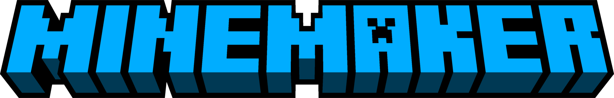

🚧 Minemaker is a currently a work in progress. The website will be unavailable until it reaches a more stable version. You are welcome to browse and contribute to this repo in the meantime :)

  

   
  

	<h1 align="center"><b>Minemaker</b></h1>
	

		A UGC platform for Minecraft: Java Edition
     
    <a href="https://minemaker.net"><strong>minemaker.net</strong></a>
  

Minemaker is a server for Minecraft: Java Edition that functions as a platform for [user-generated content (UGC)](https://en.wikipedia.org/wiki/User-generated_content#Video_games). It features a website to browse games, a desktop app to create them, and a Minecraft server to play them.

## Monorepo structure:

### Apps:

- `api`: A ElysiaJS HTTP api
- `commander`: Orchestrator for game instances
- `studio`: Tauri desktop app
- `website`: Sveltekit website

### Libraries:

- `db`: Typescript library for db operations
- `ui`: Shared Svelte components

### Plugins:

- `core`: PaperMC plugin that runs on all game instances
- `lobby`: PaperMC plugin for server lobby
- `proxy`: Velocity plugin
